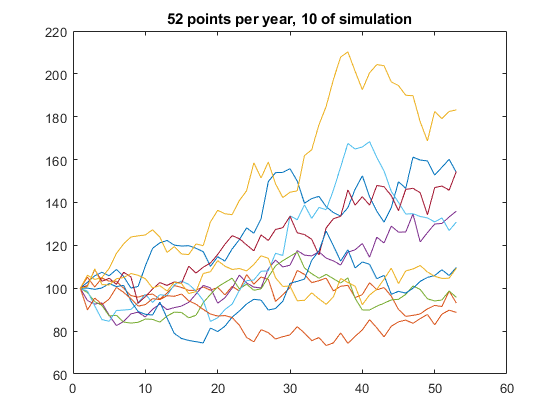

# 國立陽明交通大學 期貨與選擇權
#### 學生姓名:徐浩哲 學號:411551005
# Program Part

## 1. Time Interval of 1 Week

- Time interval = 1 month ($\mathrm{d}t = 52$)

## 2. Time Interval of 1 Month and 1 Day

- Time interval = 1 month ($\mathrm{d}t = 12$)

The stock prices show varied trajectories, with some paths increasing consistently, while others show more fluctuations. Since there are only 12 points per year, the changes between data points appear relatively smooth, and the variations seem less volatile.

- Time interval = 1 month ($\mathrm{d}t = 252$)

Compared to the first chart, the paths here appear more volatile. Since more data points are plotted (daily resolution), short-term fluctuations are more apparent. Stock prices experience greater volatility, especially toward the end of the year, with some trajectories showing significant upward or downward trends.

### Explanation of Findings:

- **Impact of Time Interval on Volatility**: When you increase the time resolution from 12 (monthly) to 252 (daily) points per year, the stock price paths appear more volatile. This is because daily data captures more of the short-term market fluctuations, while monthly data smooths out some of these daily movements.
  
- **Random Walk and Variability**: Both charts likely represent a random walk model of stock prices, a common model used in finance (such as Geometric Brownian Motion). In the daily chart, the variability of returns is more evident, and the paths deviate more from each other over time. This reflects the higher likelihood of short-term noise in stock price movements being captured at a daily frequency.

- **Longer-Term Trends**: Despite the differences in volatility, both charts tend to show an upward trend, suggesting that on average, stock prices may increase over time, but daily data captures more of the short-term ups and downs.

## 3. Histogram of the Terminal Value (Sample Sizes: 1,000 to 100,000)

- Number of samples = 1,000

- Number of samples = 10,000

- Number of samples = 100,000

### General Findings:

1. **Histogram Characteristics**:
   - The histograms for all three sample sizes exhibit a positively skewed distribution, with a peak occurring around the 100–150 value range. This shape is typical of a log-normal distribution, which is often used to model stock prices because stock returns (which are logarithmic) tend to follow a normal distribution, while stock prices follow a log-normal distribution.

2. **Impact of Increasing the Number of Simulations**:
   - 1,000 simulations: This histogram shows a lot of variability, with more noise and less smoothness in the distribution due to the smaller sample size. The bars are less consistent, making it harder to distinguish the overall shape.
   
   - 10,000 simulations: With a larger number of simulations, the histogram becomes smoother, and the log-normal shape becomes more apparent. The peak is well-defined, and the spread of the data is clearer.
   
   - 100,000 simulations: This provides the most refined histogram, showing a very smooth log-normal curve. As expected, the more simulations performed, the more closely the histogram approximates the theoretical log-normal distribution, reducing random noise.

# End-of-Chapter Problem 14.4

The probability distribution for the change in $S$ during the first three years is given by:

$$ \varPhi(3 \times 2, 3 \times 3^2) = \varPhi(6, 27) $$

For the next three years, the change follows a probability distribution of:

$$ \varPhi(3 \times 3, 3 \times 4^2) = \varPhi(9, 48) $$

The total change over the six-year period is the sum of two variables: one with a probability distribution of  $\varPhi(6, 27)$  and the other with $\varPhi(9, 48)$. Therefore, the probability distribution of the overall change is:

$$ \varPhi(6 + 9, 27 + 48) = \varPhi(15, 75) $$

Since the initial value of the variable is 5, the probability distribution for the value of the variable at the end of the six years is:

$$ \varPhi(20, 75)$$